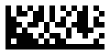

# Data Matrix · [](https://github.com/0x8b/datamatrix/blob/master/LICENSE) 

This is a software library that enables programs to **write** Data Matrix barcodes of the modern ECC200 variety.

- Supports rectangular symbols (this is optional according to ISO/IEC 16022:2006(E))

References:

- ISO/IEC 16022:2006(E)

## Table of Contents

- [Installation](#installation)
- [CLI](#cli)
- [Examples](#examples)
- [Encoding parameters](#encoding-parameters)
- [Rendering parameters](#rendering-parameters)
  - [PNG](#png-parameters)
  - [SVG](#svg-parameters)
  - [Text](#text-parameters)
- [Maximum data capacity](#maximum-data-capacity)
- [Notes](#notes)
- [Contributing](#contributing)
- [Contact](#contact)
- [License](#license)

## Installation

The package can be installed by adding `datamatrix` to your list of dependencies in mix.exs:

```exs
def deps do
  [
    {:datamatrix, "~> 0.1.3"}
  ]
end
```

To find out the latest release available on Hex, you can run `mix hex.info datamatrix` in your shell, or by going to the [datamatrix page on Hex.pm](https://hex.pm/packages/datamatrix)

Then, update your dependencies:


```console
$ mix do deps.get, deps.compile
```

## CLI

You can create Data Matrix symbols using the command line as follows:

1) Install `datamatrix` as an escript:

```console
$ mix escript.install github 0x8b/datamatrix
```

2) Then you are ready to use it:

```console
$ datamatrix -i input.txt -p        # or

$ datamatrix input_text -p          # or

$ cat input.txt | datamatrix - -p   # read standard input
```

**Note**: Don't forget to update your PATH environment variable if you want to invoke escripts by name.

For more details about using the command line tool, review the usage guide:

```console
$ datamatrix -h
```

## Examples

```ex
data = "hello"

{:ok, symbol} =
  data
  |> DataMatrix.encode(shape: :rectangle)

png =
  symbol
  |> DataMatrix.format(:png, module_size: 8)

File.write("symbol.png", png)
```



```ex
{:ok, symbol} = DataMatrix.encode("123456", quiet_zone: 4)

svg = DataMatrix.format(symbol, :svg, light: "#ffff00", width: 200)

File.write!("square.svg", svg)
```


## Encoding parameters

`DataMatrix.encode` returns `{:ok, symbol}` or `{:error, reason}`

| Parameter | Default value | Description |
| :-- | :-- | :-- |
| `quiet_zone` | `1` | All four sides of symbol are surrounded by quiet zone border. |
| `version` | auto | See [Maximum data capacity](#maximum-data-capacity). Version is selected automatically if not specified. |
| `shape` | `:square` | Shape of symbol. Available shapes are `:square` and `:rectangle`. |


## Rendering parameters

Available output formats:

- [PNG](#png-parameters)
- [SVG](#svg-parameters)
- [Text](#text-parameters)

### PNG parameters

| Parameter name | Default value | Description |
| :-- | :-- | :-- |
| `module_size` | `10` | Size of module in pixels. |
| `dark` | `"#000000"` | Color of dark module. Only **#RRGGBB** |
| `light` | `"#ffffff"` | Color of light module. Only **#RRGGBB**|

### SVG parameters

| Parameter name | Default value | Description |
| :-- | :-- | :-- |
| `width` | auto | Width in pixels (quiet zone included). |
| `height` | auto | Height in pixels (quiet zone included). |
| `viewbox` | `false` | Width and height are not included in SVG if `viewbox` is set to `true`. |
| `module_size` | `5` | Size of module in pixles. |
| `dark` | `"black"` | Color of dark module. Color syntax for SVG [w3.org 🡕](https://www.w3.org/TR/SVGColor12/#Color_syntax) |
| `light` | `"white"` | Color of light module. |

### Text parameters

| Parameter name | Default value | Description |
| :-- | :-- | :-- |
| `dark` | `"1"` | Representation of dark module. |
| `light` | `"0"` | Representation of light module. |
| `separator` | `""` | String that is used to join modules in a row. |
| `newline` | `"\n"` | String that is used to join rows. |

## Maximum data capacity

[See docs/maximum_data_capacity.md](docs/maximum_data_capacity.md)

## Notes

All additional features mentioned below will be provided in next major releases.

ECC 200 includes various **encodation schemes** which allow a defined set of characters to be converted  into codewords more efficiently than the default scheme.

**Extended  Channel  Interpretations** mechanism  enables characters from other character sets (e.g. Arabic, Cyrillic, Greek, Hebrew) and other data interpretations or industry-specific requirements to be represented.

**Structured append** allows files of data to be represented in up to 16 Data Matrix  symbols.  The  original  data  can  be  correctly  reconstructed  regardless  of  the  order  in  which  the  symbols are scanned.

## Contributing

Pull requests are welcome. For major changes, please open an issue first to discuss what you would like to change.

Please make sure to:
- update tests as appropriate
- run `mix format`

## Contact

If you want to contact me you can reach me at <mkgumienny@gmail.com>

## License

[MIT](LICENSE)